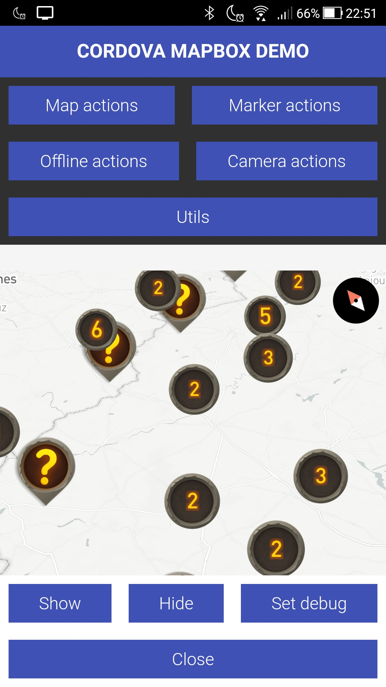

# Demo fof Mapbox plugin for Cordova
This is a demo for the [Mapbox plugin](https://github.com/dagatsoin/cordova-plugin-mapbox).

## Requirements :
:white_check_mark: Android 4.4 (API level 19)

:x: iOS is not supported yet.

## Install
1. Clone this repository
2. Set your Mapbox access token in the package.json
3. `$ npm i`
4. `$ npm run android`
